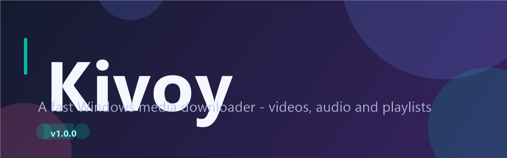

# Kivoy

<p align="center">
  
</p>

A modern Windows desktop app (WPF / .NET 8) for downloading YouTube videos and playlists, built with an IDM-style workflow. Sign in once with your Google account, paste a link, and download videos, audio, or entire playlists at your chosen quality.

## Features

- **YouTube sign-in** — authenticate with your Google account inside a WebView2 window to download members-only / age-restricted content with your own cookies.
- **Video & audio downloads** — grab MP4 video or extract audio (M4A recommended) at your chosen quality.
- **Playlist support** — batch-download whole playlists into their own per-playlist folder.
- **Concurrent downloads** — run multiple downloads in parallel, with per-download connection control.
- **Rich metadata** — thumbnails, titles, channels, and durations resolved before download.
- **Download history** — persisted history with retry / pause / cancel / re-download.
- **Subtitles** — optional subtitle inclusion.
- **Theme support** — light, dark, and system themes (follows Windows).
- **Clipboard detection** — auto-detects copied YouTube links.
- **Toast notifications** — on-completion alerts (optional).

## Requirements

- Windows 10/11 (x64)
- [Microsoft Edge WebView2 Runtime](https://developer.microsoft.com/microsoft-edge/webview2/) — auto-installed by the installer if missing
- Internet connection (engines are downloaded on first run)

## Installation

Download the installer from the [Releases](https://github.com/usm007/Kivoy/releases) page:

| Installer | Size | Behavior |
| --------- | ---- | -------- |
| `KivoySetup-<version>.exe` | ~29 MB | Complete offline installer bundling all required download engines (`yt-dlp`, `ffmpeg`, `ffprobe`, `QuickJS`). |

1. Download `KivoySetup-<version>.exe` and run it.
2. Launch Kivoy, sign in to YouTube (optional but recommended), and start downloading.

The app installs to `Program Files\Kivoy` and keeps its data (settings, history, engines) in `%LOCALAPPDATA%\Kivoy`.

## Download Engines & Periodic Updates

Kivoy comes pre-packaged with all required engines. While Kivoy is running, it automatically checks for plugin/`yt-dlp` updates on startup and periodically in the background (every 6 hours). When a plugin update is applied, Kivoy displays a desktop toast notification to inform you.

| Engine | Purpose | Source |
| ------ | ------- | ------ |
| [yt-dlp](https://github.com/yt-dlp/yt-dlp) | Core downloader | `yt-dlp` releases |
| [ffmpeg / ffprobe](https://www.gyan.dev/ffmpeg/builds/) | Media merge & processing | `gyan.dev` builds |
| [QuickJS](https://github.com/quickjs-ng/quickjs) | Lightweight JS script runtime for the engine (~2 MB) | `quickjs-ng` releases |

## Build from Source

```powershell
# Publish a self-contained x64 build
dotnet publish src\Kivoy\Kivoy.csproj -c Release -r win-x64 --self-contained true

# Build the installer (requires Inno Setup 6)
iscc installer\Kivoy.iss
```

The installer bundles the WebView2 Runtime bootstrapper and produces `KivoySetup-x.x.x.exe`.

## Settings

- Output folder, default download mode (video / audio)
- Video quality, audio format, and container defaults
- Max concurrent downloads and per-download connections
- Clipboard detection, completion notifications, subtitles
- Theme (system / light / dark), proxy, and optional YouTube cookies file

## Tech Stack

- **.NET 8** / **WPF** / **MVVM Toolkit** (`CommunityToolkit.Mvvm`)
- **WebView2** for YouTube sign-in
- **yt-dlp**, **ffmpeg**, **QuickJS** for download processing

## Repos Used for Help

- [yt-dlp/yt-dlp](https://github.com/yt-dlp/yt-dlp) — the underlying download engine
- [quickjs-ng/quickjs](https://github.com/quickjs-ng/quickjs) — lightweight JS runtime for the engine
- [BtbN/FFmpeg-Builds](https://github.com/BtbN/FFmpeg-Builds) — source of the ffmpeg builds used (hosted at [gyan.dev](https://www.gyan.dev/ffmpeg/builds/))
- [CommunityToolkit/dotnet](https://github.com/CommunityToolkit/dotnet) — MVVM toolkit used for the UI
- [Microsoft WebView2](https://developer.microsoft.com/microsoft-edge/webview2/) — embedded browser for sign-in

## Privacy

Your Google sign-in cookies are stored locally in `%LOCALAPPDATA%\Kivoy` and are used only to authenticate downloads on your own machine. They are never uploaded anywhere.

## License

This project is for personal use. yt-dlp, ffmpeg, and QuickJS are third-party projects with their own licenses.
